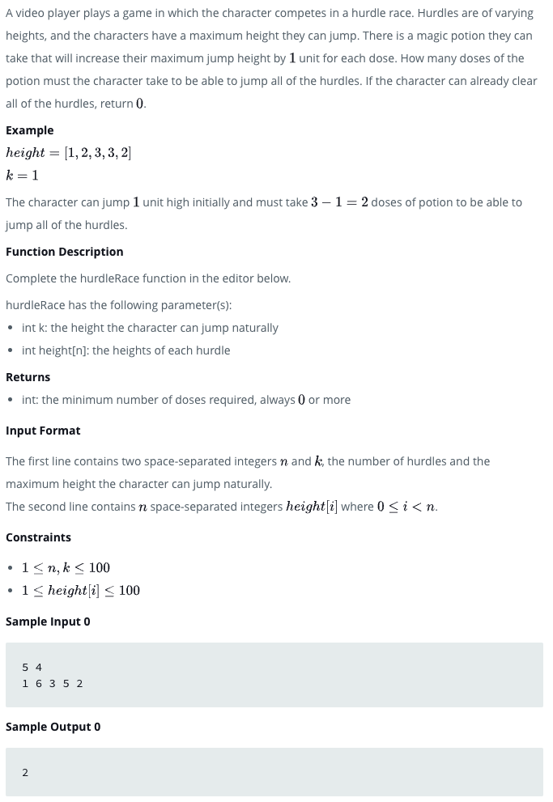
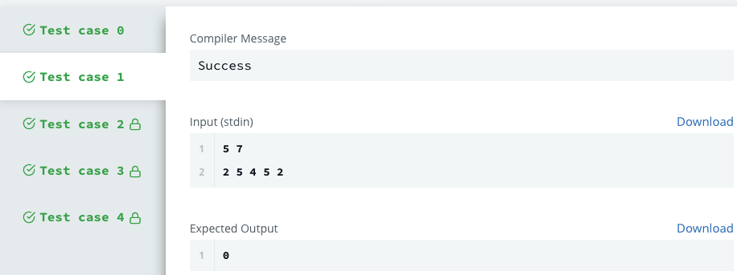

# Design PDF Viewer
When a contiguous block of text is selected in a PDF viewer, the selection is highlighted with a blue rectangle. In this PDF viewer, each word is highlighted independently.

### Official Link

https://www.hackerrank.com/challenges/designer-pdf-viewer/problem?isFullScreen=true

## Problem

## Test
