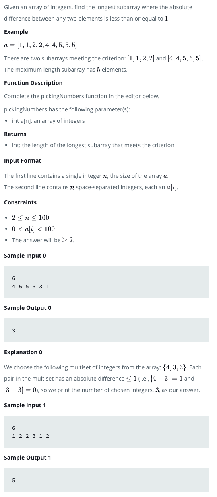
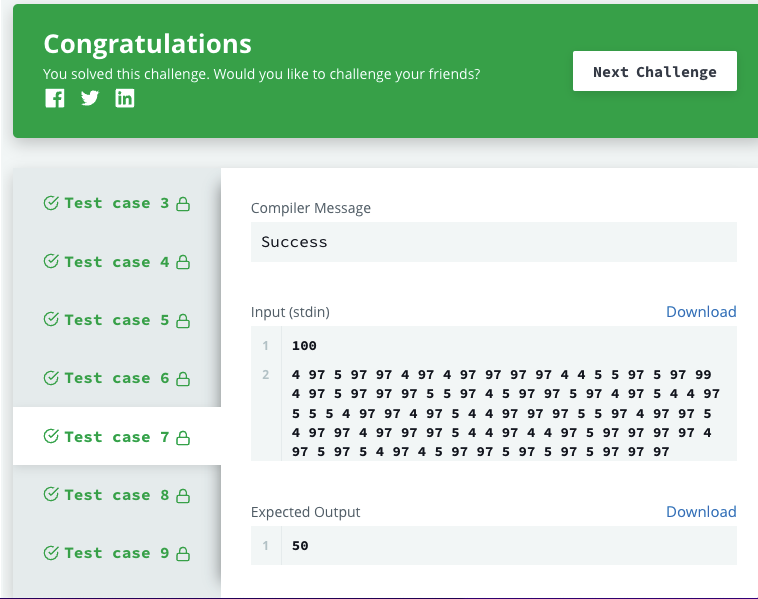

# Picking Numbers
Given an array of integers, find the longest subarray where the absolute difference between any two elements is less than or equal to 1.

### Official Link

https://www.hackerrank.com/challenges/picking-numbers/problem?isFullScreen=true

## Electric Shop

## Test
